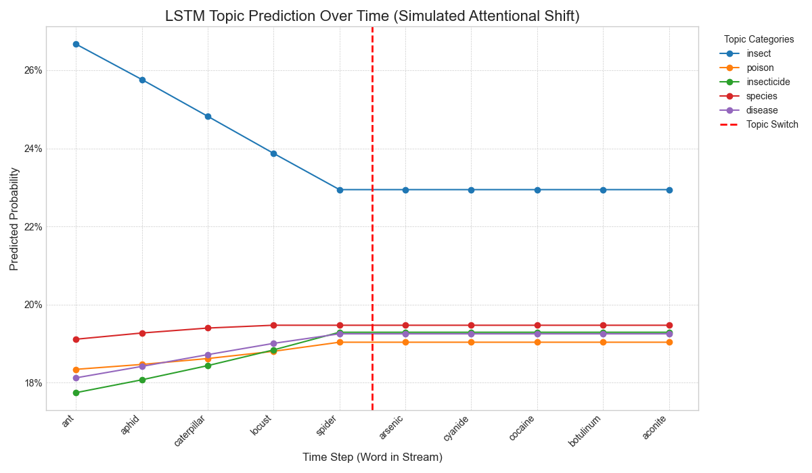

# LSTM for Topic Prediction and Attentional Shift Simulation

## 1. Project Objective

This project implements a simple Long Short-Term Memory (LSTM) network to perform topic classification on a stream of words. It is designed as a **neural network counterpart** to the symbolic ECAN "Shifting and Drifting Attention" experiment.

The goal is to train a model to identify topics (like 'insect' and 'poison') and then test its ability to shift its focus when the topic of the input stream changes abruptly. This allows for a direct comparison between a symbolic and a neural approach to the focus allocation problem.

## 2. How It Works

The project is divided into two main scripts:

#### `train_lstm.py`
This script is responsible for creating and training the model. It performs the following steps:
1.  **Generates a synthetic dataset** from a predefined dictionary of words for five categories (insect, poison, insecticide, species, disease).
2.  **Defines a simple Keras Sequential model** consisting of an `Embedding` layer, an `LSTM` layer, and a final `Dense` classification layer.
3.  **Trains the model** on the generated data to learn the association between word sequences and topics.
4.  **Saves the trained model** (`lstm_topic_model.keras`) and its tokenizer (`tokenizer.json`) for use in the next step.

#### `test_and_plot_lstm.py`
This script loads the trained model and simulates the attentional shift experiment.
1.  **Loads the saved `lstm_topic_model.keras`** and `tokenizer.json`.
2.  **Feeds a predefined sequence of words** to the model one at a time. The sequence begins with 'insect' words and abruptly switches to 'poison' words.
3.  **Records the model's topic predictions** (a set of probabilities) at each step.
4.  **Generates a plot** (`lstm_attention_shift_plot.png`) visualizing how the topic probabilities change over time.

## 3. How to Run

To replicate the experiment, follow these steps:

1.  **Clone the repository:**
    ```bash
    git clone <your-repo-url>
    cd <your-repo-name>
    ```

2.  **Set up a virtual environment and install dependencies:**
    ```bash
    # Create and activate a virtual environment (optional but recommended)
    python -m venv venv
    source venv/bin/activate  # On Windows, use `venv\Scripts\activate`

    # Install required libraries
    pip install -r requirements.txt
    ```

3.  **Train the model:**
    Run the training script. This will create the `lstm_topic_model.keras` and `tokenizer.json` files.
    ```bash
    python train_lstm.py
    ```

4.  **Run the simulation and generate the plot:**
    Run the testing script. This will use the trained model to generate the final plot.
    ```bash
    python test_and_plot_lstm.py
    ```

## 4. Results

After running the simulation, the following plot is generated, showing the model's predicted topic probabilities at each time step.



### Analysis
The plot shows that the LSTM correctly identifies the initial 'insect' topic with the highest probability. However, after the topic switches to 'poison', the model **fails to shift its dominant prediction**. The prediction probabilities flatline, with 'insect' remaining the most likely topic.

This result highlights a key difference compared to the ECAN's symbolic, rule-based attention mechanism, providing a strong basis for comparing the two architectures.