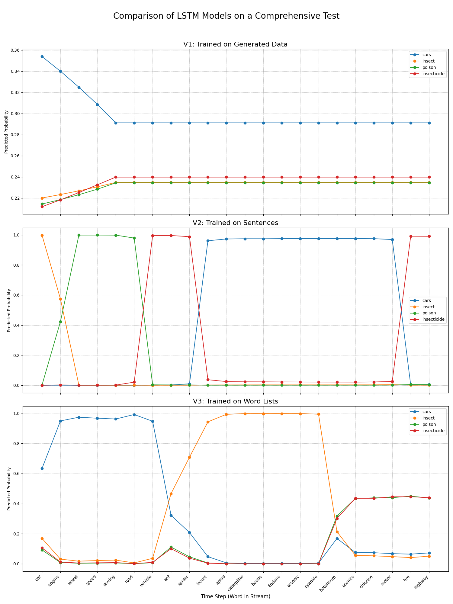

# Comparative Analysis of LSTM Models for Attentional Shift Simulation

## 1. Project Objective

This project explores the capabilities of Long Short-Term Memory (LSTM) networks in simulating cognitive attention, specifically **attentional shifting**. It serves as a neural network counterpart to symbolic attention systems like ECAN (Economic Attention Networks).

The primary goal is to analyze how different training data methodologies affect an LSTM's ability to track and shift its focus between topics. We train three distinct models on different types of data and compare their performance on a standardized test, providing insights into the strengths and weaknesses of neural approaches to focus allocation.

## 2. Project Structure & Methodology

The project is structured around three training scripts and one final analysis script. Each training script produces a different version of the LSTM model.

#### `train_v1_generated.py`
*   **Method:** Trains a baseline model on synthetically generated, short sequences of words.
*   **Purpose:** To test the model's performance when trained on simple, "pure" data without real-world context.

#### `train_v2_sentences.py`
*   **Method:** Trains a model on a dataset of realistic, full sentences for each topic.
*   **Purpose:** To evaluate if training on contextual data improves the model's ability to understand and adapt to topic changes.

#### `train_v3_words.py`
*   **Method:** Trains a model on lists of isolated vocabulary words for each topic.
*   **Purpose:** To test the model's performance when learning static `word -> topic` associations without any sequential context.

#### `test_and_plot_all.py`
*   **Method:** Loads all three trained models and runs a single, comprehensive test stream against each one.
*   **Purpose:** To generate a final comparative plot that visualizes the performance of each model on the same attentional shift task, allowing for a direct comparison of their behaviors.

## 3. How to Run

Follow these steps to set up the environment and replicate the experiment.

1.  **Clone the repository:**
    ```bash
    git clone https://github.com/Macmilan24/LSTM_For_Attentional_Shift.git
    cd LSTM_For_Attentional_Shift
    ```

2.  **Set up the environment and install dependencies:**
    *   Ensure your data is organized in a `data/` directory as specified in the project structure.
    *   It is highly recommended to use a virtual environment.
    ```bash
    # Create and activate a virtual environment (optional but recommended)
    python -m venv venv
    source venv/bin/activate  # On Windows, use `venv\Scripts\activate`

    # Install required libraries
    pip install -r requirements.txt
    ```

3.  **Train the three models:**
    Run each training script sequentially. This will generate the necessary `.keras` and `.json` files for each model.
    ```bash
    python train_v1_generated.py
    python train_v2_sentences.py
    python train_v3_words.py
    ```

4.  **Run the final comparison:**
    Execute the test script to evaluate all models and generate the comparative plot.
    ```bash
    python test_and_plot_all.py
    ```

## 4. Results and Analysis

The final output is a single image (`final_comparison_plot.png`) containing three subplots, one for each model. This allows for a direct comparison of their performance on the attentional shift test.



### Summary of Findings:
*   **Model V1 (Generated Data):** This baseline model fails to shift its attention. After locking onto the initial topic, its predictions flatline when the topic changes, showing an inability to adapt.
*   **Model V2 (Sentence Data):** This model performs the best on the core task. It successfully shifts its attention between topics, demonstrating that training on contextual data is effective. However, it can show instability and difficulty returning to a previous context.
*   **Model V3 (Word List Data):** This model learns strong initial associations but suffers from extreme "context inertia." It confidently identifies the first topic but then completely fails to adapt to any subsequent changes.

This comparative analysis demonstrates that the quality and context of training data are critically important for a neural network's ability to perform complex cognitive tasks like attentional shifting, highlighting a key difference from the explicit, rule-based reasoning of symbolic systems like ECAN.